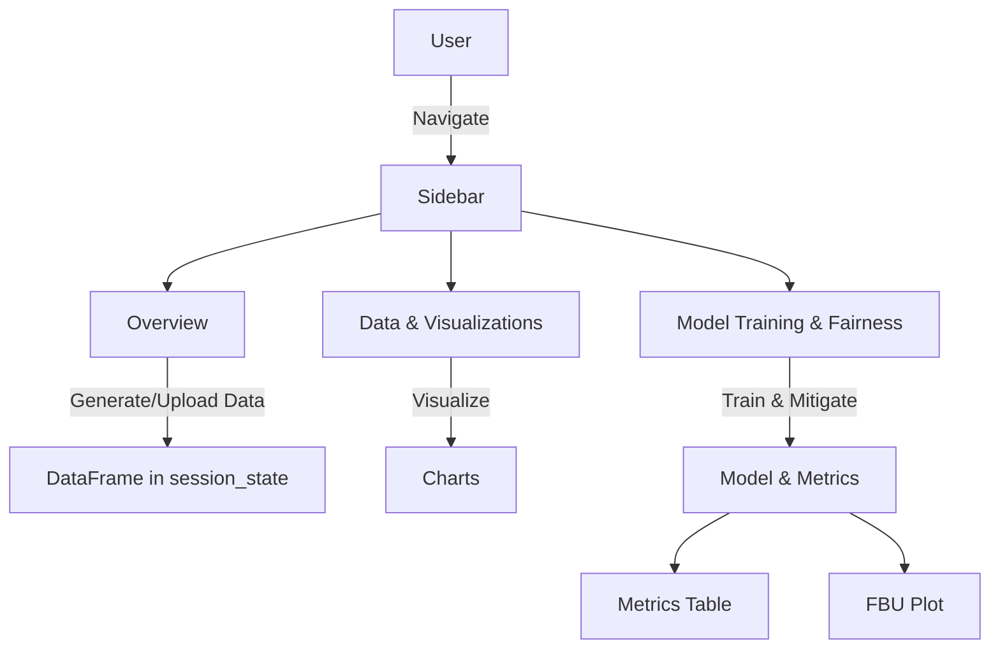

id: 68e421bb0025b593c45b5ae7_documentation
summary: FairAIED: Navigating Fairness, Bias, and Ethics in Educational AI Applications Documentation
feedback link: https://docs.google.com/forms/d/e/1FAIpQLSfWkOK-in_bMMoHSZfcIvAeO58PAH9wrDqcxnJABHaxiDqhSA/viewform?usp=sf_link
environments: Web
status: Published
# FairAIED: Ethical AIED Design Assistant

## 1. Setup & Environment Check
**Duration: 0:15**

The first step is to configure the Streamlit app and verify that all required libraries are available.  
The `st.set_page_config` call sets the page title and layout, while the sidebar hosts the navigation menu.  
Below is the minimal code that initializes the app and prints library versions for reproducibility.

```python
import streamlit as st
import pandas as pd
import numpy as np
import matplotlib
import seaborn as sns
import sklearn
from fairlearn import __version__ as fairlearn_version
import plotly.express as px

st.set_page_config(page_title="FairAIED: Navigating Fairness, Bias, and Ethics in Educational AI Applications", layout="wide")
st.sidebar.image("https://www.quantuniversity.com/assets/img/logo5.jpg")
st.sidebar.divider()
st.title("QuLab: FairAIED")
st.divider()

st.markdown("""
## 1. Imports and Environment Check

We import all libraries that will be used throughout the application and print their versions to ensure reproducibility.
Knowing the exact library versions helps trace any unexpected behavior and guarantees that the results can be replicated by other users.
""")

st.write("### Library Versions")
st.write(f"pandas: {pd.__version__}")
st.write(f"numpy: {np.__version__}")
st.write(f"matplotlib: {matplotlib.__version__}")
st.write(f"seaborn: {sns.__version__}")
st.write(f"scikit-learn: {sklearn.__version__}")
st.write(f"fairlearn: {fairlearn_version}")
st.write(f"plotly: {px.__version__}")
```

<aside class="positive">
<b>Tip:</b> Use `st.cache_data` for data generation and `st.cache_resource` for model training to avoid recomputation when the same inputs are reused.
</aside>


## 2. Data Generation & Validation
**Duration: 0:45**

The application supports both synthetic data generation and CSV upload.  
The synthetic generator creates realistic student attributes and a continuous `final_grade`.  
After loading, the data is validated for column names, data types, and missing values.

```python
@st.cache_data
def generate_synthetic_data(num_samples=100, random_seed=42):
    np.random.seed(random_seed)
    study_hours = np.random.randint(0, 100, num_samples).astype(float)
    prior_knowledge = np.random.randint(0, 2, num_samples)
    access_to_resources = np.random.randint(0, 2, num_samples)
    gender = np.random.choice(['Male', 'Female'], num_samples)
    final_grade = (0.5 * study_hours + 0.3 * prior_knowledge * 100 +
                   0.2 * access_to_resources * 100 + np.random.normal(0, 10, num_samples))
    final_grade = np.clip(final_grade, 0, 100).astype(float)
    return pd.DataFrame({
        'study_hours': study_hours,
        'prior_knowledge': prior_knowledge,
        'access_to_resources': access_to_resources,
        'gender': gender,
        'final_grade': final_grade
    })

st.sidebar.header("Data Configuration")
data_source_option = st.sidebar.radio(
    "Choose Data Source:",
    ("Generate Synthetic Data", "Upload Custom Data (CSV)"),
    key="data_source_radio"
)

df_local = None
if data_source_option == "Generate Synthetic Data":
    num_samples = st.slider("Number of samples", 50, 1000, 100, 50, key="num_samples_slider")
    seed = st.number_input("Random seed", 1, 1000, 42, 1, key="random_seed_input")
    df_local = generate_synthetic_data(num_samples, seed)
    st.write("Synthetic dataset head:")
    st.dataframe(df_local.head())
else:
    uploaded_file = st.file_uploader("Upload your CSV file", type=["csv"], key="file_uploader")
    if uploaded_file:
        df_local = pd.read_csv(uploaded_file)
        st.write("Uploaded dataset head:")
        st.dataframe(df_local.head())
    else:
        st.info("Please upload a CSV file or switch to synthetic data generation.")
        df_local = generate_synthetic_data(100, 42)
        st.dataframe(df_local.head())

if df_local is not None:
    st.session_state['df'] = df_local
else:
    st.error("No data available. Please generate or upload data.")
    return
```

```python
@st.cache_data
def validate_data(df):
    expected_columns = ['study_hours', 'prior_knowledge', 'access_to_resources', 'gender', 'final_grade']
    expected_dtypes = {
        'study_hours': np.float64,
        'prior_knowledge': np.int64,
        'access_to_resources': np.int64,
        'gender': object,
        'final_grade': np.float64
    }

    def validate_column_names(df, expected_columns):
        return set(expected_columns) == set(df.columns)

    def validate_data_types(df, expected_dtypes):
        for col, dtype in expected_dtypes.items():
            if col not in df.columns or df[col].dtype != dtype:
                try:
                    df[col].astype(dtype)
                except:
                    return False
        return True

    def check_missing_values(df, columns):
        return pd.Series({c: df[c].isnull().sum() for c in columns})

    col_names_valid = validate_column_names(df, expected_columns)
    data_types_valid = validate_data_types(df, expected_dtypes)
    missing = check_missing_values(df, expected_columns)
    return col_names_valid, data_types_valid, missing

col_names_valid, data_types_valid, missing = validate_data(st.session_state['df'])
st.write(f"Column names valid: {col_names_valid}")
st.write(f"Data types valid: {data_types_valid}")
st.write("Missing values per column:")
st.dataframe(missing.to_frame())
```

<aside class="positive">
<b>Best Practice:</b> Store the processed dataframe in `st.session_state` so that subsequent pages can access it without re‑loading.
</aside>


## 3. Data Visualization
**Duration: 0:30**

After validation, the app offers descriptive statistics and visual insights.  
Histograms, scatter plots, and bar charts reveal distributions and potential gender gaps.

```python
@st.cache_data
def calculate_descriptive_statistics(df, numeric_columns):
    numeric_df = df[numeric_columns].select_dtypes(include=['number'])
    description = numeric_df.describe()
    skewness = pd.DataFrame(numeric_df.skew(), columns=['skew']).T
    kurtosis = pd.DataFrame(numeric_df.kurtosis(), columns=['kurt']).T
    return pd.concat([description, skewness, kurtosis]).T

numeric_cols = ['study_hours', 'prior_knowledge', 'access_to_resources', 'final_grade']
desc_stats = calculate_descriptive_statistics(st.session_state['df'], numeric_cols)
st.write("Descriptive statistics:")
st.dataframe(desc_stats)
```

```python
# Histograms
fig_hist, axes = plt.subplots(1, 4, figsize=(16, 4))
sns.set_palette("viridis")
for i, col in enumerate(['study_hours', 'prior_knowledge', 'access_to_resources', 'final_grade']):
    sns.histplot(st.session_state['df'][col], kde=True, ax=axes[i])
    axes[i].set_title(f'Histogram of {col}')
    axes[i].set_xlabel(col)
    axes[i].set_ylabel('Frequency')
plt.tight_layout()
st.pyplot(fig_hist)
plt.close(fig_hist)

# Scatter plot: study_hours vs final_grade colored by gender
fig_scatter = px.scatter(st.session_state['df'],
                         x='study_hours', y='final_grade',
                         color='gender',
                         title='Study Hours vs Final Grade by Gender',
                         color_discrete_sequence=px.colors.qualitative.Pastel)
fig_scatter.update_layout(xaxis_title='Study Hours',
                          yaxis_title='Final Grade',
                          title_font_size=16,
                          legend_title_font_size=14)
st.plotly_chart(fig_scatter)

# Bar chart: average final grade by gender
avg_by_gender = st.session_state['df'].groupby('gender')['final_grade'].mean().reset_index()
fig_bar = px.bar(avg_by_gender,
                 x='gender', y='final_grade',
                 title='Average Final Grade by Gender',
                 color='gender',
                 color_discrete_sequence=px.colors.qualitative.Pastel)
fig_bar.update_layout(xaxis_title='Gender',
                      yaxis_title='Average Final Grade',
                      title_font_size=16)
st.plotly_chart(fig_bar)
```

<aside class="positive">
<b>Insight:</b> Visualizing gender differences early helps identify bias before modeling.
</aside>


## 4. Baseline Model Training
**Duration: 0:20**

A logistic regression classifier is trained on the binary `pass` target (`final_grade >= 70`).  
The baseline accuracy is computed on the held‑out test set.

```python
from sklearn.linear_model import LogisticRegression
from sklearn.metrics import accuracy_score
from sklearn.model_selection import train_test_split
from sklearn.preprocessing import LabelEncoder

# Prepare data
df = st.session_state['df'].copy()
df['pass'] = (df['final_grade'] >= 70).astype(int)
le = LabelEncoder()
df['gender_encoded'] = le.fit_transform(df['gender'])

X = df[['study_hours', 'prior_knowledge', 'access_to_resources', 'gender_encoded']]
y = df['pass']

X_train, X_test, y_train, y_test = train_test_split(
    X, y, test_size=st.session_state.get('test_size_input', 0.2),
    random_state=st.session_state.get('train_random_state_input', 42),
    stratify=y
)

st.session_state['X_train'] = X_train
st.session_state['X_test'] = X_test
st.session_state['y_train'] = y_train
st.session_state['y_test'] = y_test
st.session_state['sensitive_train'] = X_train['gender_encoded'].values
st.session_state['sensitive_test'] = X_test['gender_encoded'].values

@st.cache_resource
def train_baseline_model(X_train, y_train, X_test, y_test):
    model = LogisticRegression(max_iter=1000)
    model.fit(X_train, y_train)
    y_pred = model.predict(X_test)
    acc = accuracy_score(y_test, y_pred)
    return model, y_pred, acc

baseline_model, y_pred_baseline, baseline_accuracy = train_baseline_model(X_train, y_train, X_test, y_test)
st.write(f"Baseline Accuracy: {baseline_accuracy:.4f}")
```


## 5. Fairness Metrics (Before Mitigation)
**Duration: 0:20**

Three core fairness metrics are computed: Statistical Parity, Equal Opportunity, and Predictive Parity.

```python
@st.cache_data
def calculate_statistical_parity_difference(y_true, y_pred, sensitive_features):
    g0 = (sensitive_features == 0)
    g1 = (sensitive_features == 1)
    return y_pred[g1].mean() - y_pred[g0].mean()

@st.cache_data
def calculate_equal_opportunity_difference(y_true, y_pred, sensitive_features):
    df_temp = pd.DataFrame({'y_true': y_true, 'y_pred': y_pred, 'sensitive': sensitive_features})
    tpr0 = df_temp[(df_temp['sensitive']==0) & (df_temp['y_true']==1) & (df_temp['y_pred']==1)].shape[0] / \
           df_temp[(df_temp['sensitive']==0) & (df_temp['y_true']==1)].shape[0]
    tpr1 = df_temp[(df_temp['sensitive']==1) & (df_temp['y_true']==1) & (df_temp['y_pred']==1)].shape[0] / \
           df_temp[(df_temp['sensitive']==1) & (df_temp['y_true']==1)].shape[0]
    return tpr0 - tpr1

@st.cache_data
def calculate_predictive_parity_difference(y_true, y_pred, sensitive_features):
    pos0 = (sensitive_features==0) & (y_pred==1)
    pos1 = (sensitive_features==1) & (y_pred==1)
    ppv0 = y_true[pos0].mean() if pos0.any() else 0
    ppv1 = y_true[pos1].mean() if pos1.any() else 0
    return abs(ppv1 - ppv0)

sp_baseline = calculate_statistical_parity_difference(y_test.values, y_pred_baseline, st.session_state['sensitive_test'])
eo_baseline = calculate_equal_opportunity_difference(y_test.values, y_pred_baseline, st.session_state['sensitive_test'])
pp_baseline = calculate_predictive_parity_difference(y_test.values, y_pred_baseline, st.session_state['sensitive_test'])

st.write(f"Statistical Parity Difference (Baseline): {sp_baseline:.4f}")
st.write(f"Equal Opportunity Difference (Baseline): {eo_baseline:.4f}")
st.write(f"Predictive Parity Difference (Baseline): {pp_baseline:.4f}")
```


## 6. Pre‑processing Mitigation – Reweighting
**Duration: 0:20**

Reweighting adjusts sample weights so that the sensitive attribute distribution matches the overall distribution.  
The weighted logistic regression is then evaluated.

```python
from fairlearn.preprocessing import Reweighing

@st.cache_resource
def apply_reweighting(X_train, y_train, X_test, y_test, sensitive_train, sensitive_test):
    df_train = X_train.copy()
    df_train['pass'] = y_train
    df_train['gender'] = df_train['gender_encoded']

    rw = Reweighing(attrs=['gender'])
    rw.fit(df_train[['gender']], df_train['pass'])
    weights = rw.transform(df_train[['gender']])

    model_rw = LogisticRegression(max_iter=1000)
    model_rw.fit(X_train, y_train, sample_weight=weights.iloc[:,0])
    y_pred_rw = model_rw.predict(X_test)
    acc_rw = accuracy_score(y_test, y_pred_rw)

    sp_rw = calculate_statistical_parity_difference(y_test.values, y_pred_rw, sensitive_test)
    eo_rw = calculate_equal_opportunity_difference(y_test.values, y_pred_rw, sensitive_test)
    pp_rw = calculate_predictive_parity_difference(y_test.values, y_pred_rw, sensitive_test)

    return acc_rw, sp_rw, eo_rw, pp_rw

acc_rw, sp_rw, eo_rw, pp_rw = apply_reweighting(
    X_train, y_train, X_test, y_test,
    st.session_state['sensitive_train'], st.session_state['sensitive_test']
)
st.write(f"Accuracy after Reweighting: {acc_rw:.4f}")
st.write(f"Statistical Parity Difference (Reweighting): {sp_rw:.4f}")
st.write(f"Equal Opportunity Difference (Reweighting): {eo_rw:.4f}")
st.write(f"Predictive Parity Difference (Reweighting): {pp_rw:.4f}")
```


## 7. In‑processing Mitigation – Exponentiated Gradient
**Duration: 0:25**

Exponentiated Gradient (EG) iteratively enforces a fairness constraint while optimizing accuracy.  
Both Demographic Parity and Equalized Odds are demonstrated.

```python
from fairlearn.reductions import ExponentiatedGradient, DemographicParity, EqualizedOdds

@st.cache_resource
def apply_exponentiated_gradient(X_train, y_train, X_test, y_test, sensitive_train, sensitive_test):
    # Demographic Parity
    eg_dp = ExponentiatedGradient(LogisticRegression(max_iter=1000), constraints=DemographicParity())
    eg_dp.fit(X_train, y_train, sensitive_features=sensitive_train)
    y_pred_dp = eg_dp.predict(X_test)
    acc_dp = accuracy_score(y_test, y_pred_dp)
    sp_dp = calculate_statistical_parity_difference(y_test.values, y_pred_dp, sensitive_test)
    eo_dp = calculate_equal_opportunity_difference(y_test.values, y_pred_dp, sensitive_test)
    pp_dp = calculate_predictive_parity_difference(y_test.values, y_pred_dp, sensitive_test)

    # Equalized Odds
    eg_eo = ExponentiatedGradient(LogisticRegression(max_iter=1000), constraints=EqualizedOdds())
    eg_eo.fit(X_train, y_train, sensitive_features=sensitive_train)
    y_pred_eo = eg_eo.predict(X_test)
    acc_eo = accuracy_score(y_test, y_pred_eo)
    sp_eo = calculate_statistical_parity_difference(y_test.values, y_pred_eo, sensitive_test)
    eo_eo = calculate_equal_opportunity_difference(y_test.values, y_pred_eo, sensitive_test)
    pp_eo = calculate_predictive_parity_difference(y_test.values, y_pred_eo, sensitive_test)

    return (acc_dp, sp_dp, eo_dp, pp_dp,
            acc_eo, sp_eo, eo_eo, pp_eo)

(acc_dp, sp_dp, eo_dp, pp_dp,
 acc_eo, sp_eo, eo_eo, pp_eo) = apply_exponentiated_gradient(
    X_train, y_train, X_test, y_test,
    st.session_state['sensitive_train'], st.session_state['sensitive_test']
)

st.write(f"Accuracy (EG DP): {acc_dp:.4f}")
st.write(f"Statistical Parity (EG DP): {sp_dp:.4f}")
st.write(f"Equal Opportunity (EG DP): {eo_dp:.4f}")
st.write(f"Predictive Parity (EG DP): {pp_dp:.4f}")

st.write(f"Accuracy (EG EO): {acc_eo:.4f}")
st.write(f"Statistical Parity (EG EO): {sp_eo:.4f}")
st.write(f"Equal Opportunity (EG EO): {eo_eo:.4f}")
st.write(f"Predictive Parity (EG EO): {pp_eo:.4f}")
```


## 8. Post‑processing Mitigation – Threshold Optimizer
**Duration: 0:20**

The Threshold Optimizer learns group‑specific decision thresholds to satisfy a fairness constraint while minimizing loss.

```python
from fairlearn.postprocessing import ThresholdOptimizer

@st.cache_resource
def apply_threshold_optimizer(X_train, y_train, X_test, y_test, sensitive_train, sensitive_test):
    base_model = LogisticRegression(max_iter=1000)
    base_model.fit(X_train, y_train)

    to = ThresholdOptimizer(
        estimator=base_model,
        constraints=DemographicParity(),
        predict_method='predict',
        prefit=False
    )
    to.fit(X_train, y_train, sensitive_features=sensitive_train)
    y_pred_to = to.predict(X_test)
    acc_to = accuracy_score(y_test, y_pred_to)
    sp_to = calculate_statistical_parity_difference(y_test.values, y_pred_to, sensitive_test)
    eo_to = calculate_equal_opportunity_difference(y_test.values, y_pred_to, sensitive_test)
    pp_to = calculate_predictive_parity_difference(y_test.values, y_pred_to, sensitive_test)

    return acc_to, sp_to, eo_to, pp_to

(acc_to, sp_to, eo_to, pp_to) = apply_threshold_optimizer(
    X_train, y_train, X_test, y_test,
    st.session_state['sensitive_train'], st.session_state['sensitive_test']
)

st.write(f"Accuracy (Threshold Optimizer): {acc_to:.4f}")
st.write(f"Statistical Parity (TO): {sp_to:.4f}")
st.write(f"Equal Opportunity (TO): {eo_to:.4f}")
st.write"Predictive Parity (TO): {pp_to:.4f}")
```


## 9. Comparative Metrics Table & Fairness‑Bonded Utility (FBU)
**Duration: 0:20**

All metrics are compiled into a single table.  
The FBU score combines accuracy and statistical parity into a single metric.

```python
def compile_metrics():
    methods = ['Baseline', 'Reweighting', 'EG DP', 'EG EO', 'Threshold Optimizer']
    accuracies = [baseline_accuracy, acc_rw, acc_dp, acc_eo, acc_to]
    sp_vals = [sp_baseline, sp_rw, sp_dp, sp_eo, sp_to]
    eo_vals = [eo_baseline, eo_rw, eo_dp, eo_eo, eo_to]
    pp_vals = [pp_baseline, pp_rw, pp_dp, pp_eo, pp_to]
    df = pd.DataFrame({
        'Method': methods,
        'Accuracy': accuracies,
        'Statistical Parity': sp_vals,
        'Equal Opportunity': eo_vals,
        'Predictive Parity': pp_vals
    })
    return df

metrics_df = compile_metrics()
st.dataframe(metrics_df)

# Fairness‑Bonded Utility
def fbu(accuracy, fairness_gap):
    return accuracy * (1 - abs(fairness_gap))

metrics_df['FBU'] = metrics_df.apply(lambda r: fbu(r['Accuracy'], r['Statistical Parity']), axis=1)
st.dataframe(metrics_df[['Method', 'Accuracy', 'Statistical Parity', 'FBU']])

# Trade‑off plot
fig_fbu = px.scatter(metrics_df,
                     x='Statistical Parity',
                     y='Accuracy',
                     color='Method',
                     title='Accuracy vs. Statistical Parity Difference',
                     hover_name='Method',
                     color_discrete_sequence=px.colors.qualitative.Vivid)
fig_fbu.add_hline(y=0.8, line_dash="dash", line_color="gray",
                  annotation_text="80% Accuracy Threshold",
                  annotation_position="bottom right",
                  annotation_font_size=12)
fig_fbu.add_vline(x=0.05, line_dash="dash", line_color="gray",
                  annotation_text="5% Parity Gap Threshold",
                  annotation_position="top left",
                  annotation_font_size=12)
fig_fbu.update_layout(xaxis_title='Statistical Parity Difference',
                      yaxis_title='Accuracy',
                      title_font_size=16,
                      height=500)
st.plotly_chart(fig_fbu)
```


## 10. Interactive Exploration
**Duration: 0:15**

Users can adjust the logistic regression regularization strength (`C`) and choose a sensitive attribute to observe real‑time changes in accuracy and fairness.

```python
C_value = st.slider('Regularization (C):', 0.01, 10.0, 1.0, 0.01, key='interactive_c_slider')
sensitive_attr = st.selectbox('Sensitive Attribute:',
                              ['gender_encoded', 'prior_knowledge', 'access_to_resources'],
                              index=0, key='interactive_sensitive_attr_select')

@st.cache_resource
def retrain_and_evaluate(C, attr, X_train, y_train, X_test, y_test, sensitive_test):
    model = LogisticRegression(C=C, max_iter=1000)
    model.fit(X_train, y_train)
    y_pred = model.predict(X_test)
    acc = accuracy_score(y_test, y_pred)
    sp = calculate_statistical_parity_difference(y_test.values, y_pred, X_test[attr].values)
    return acc, sp

acc_int, sp_int = retrain_and_evaluate(C_value, sensitive_attr,
                                       X_train, y_train, X_test, y_test,
                                       st.session_state['sensitive_test'])
st.write(f"**Current Model Performance (C={C_value:.2f}, Sensitive Attribute='{sensitive_attr}'):**")
st.write(f"Accuracy: {acc_int:.4f}")
st.write(f"Statistical Parity Difference: {sp_int:.4f}")
```

<aside class="positive">
<b>Engagement Tip:</b> Let stakeholders experiment with different `C` values to see how stricter regularization can reduce bias but may affect accuracy.
</aside>


## 11. Conclusion & Next Steps
**Duration: 0:10**

The application demonstrates a full pipeline from data generation to fairness‑aware modeling.  
Key takeaways:

1. **Data hygiene** is foundational; validate before modeling.  
2. **Baseline metrics** provide a reference point for fairness improvements.  
3. **Multiple mitigation strategies** (pre‑, in‑, post‑processing) allow trade‑off exploration.  
4. **FBU** offers a single scalar to compare methods.  
5. **Interactive widgets** empower non‑technical stakeholders to understand the impact of hyper‑parameters.

Future enhancements could include:

- Adding more sophisticated synthetic data generators (e.g., using `scikit‑learn`’s `make_classification`).  
- Integrating additional fairness libraries (e.g., `AIF360`).  
- Deploying the app as a Docker container for reproducible production use.


## 12. References
1. Fairlearn documentation: https://fairlearn.org/  
2. scikit‑learn documentation: https://scikit-learn.org/stable/  
3. Seaborn documentation: https://seaborn.pydata.org/  
4. Plotly documentation: https://plotly.com/python/  
5. *Fairness‑Bonded Utility (FBU)* concept – derived from recent fairness‑in‑machine‑learning literature.


## Architecture Diagram

